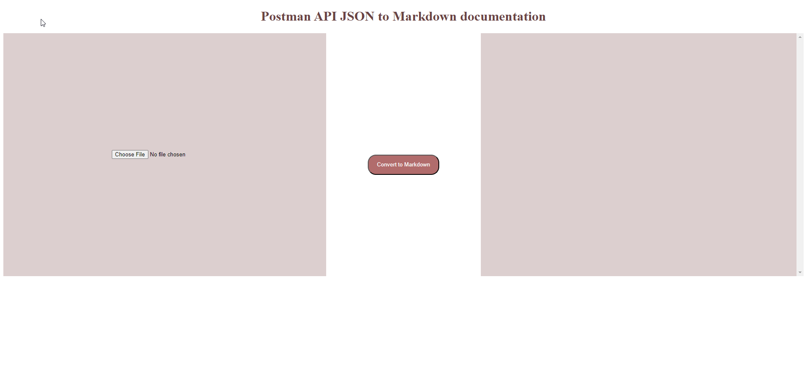

# Postman JSON to Markdown Converter

## Overview

This Node.js project allows you to convert a Postman JSON file to markdown format. It provides a user interface for easy conversion and also allows users to download the final markdown file or copy to clipboard. The application is deployed on Google App Engine for accessibility.

- [Features](#features)
- [Supported JSON versions](#supported-json-versions)
- [Prerequisites](#prerequisites)
- [Installation](#installation)
- [Usage](#usage)
- [Contributing](#contributing)
- [License](#license)
## Features

- Convert Postman JSON files to markdown.
- User-friendly web interface.
- Download the converted markdown file.
- Accessible via Google App Engine for online usage.

## Supported JSON Versions

The application currently supports Postman JSON version 2.1.

### Future Support

We intend to add support for Postman JSON version 2.0 in the future. Stay tuned for updates!

## Prerequisites

Before you begin, ensure you have met the following requirements:

- Node.js installed on your system.
- Postman JSON file that you want to convert.

## Installation

1. Clone this repository to your local machine:

   ```bash
   git clone https://github.com/ntandoyenkosi1/postman-to-markdown.git
   ```

2. Navigate to the project directory:

   ```bash
   cd postman-to-markdown
   ```

3. Install the project dependencies:

   ```bash
   npm install
   ```


## Usage

You can use this application both locally and online.

### Local Usage

1. To run the application locally, start it with the following command:

   ```bash
   npm start
   ```

2. Open your web browser and go to [http://localhost:3001](http://localhost:3001).

3. Use the user interface to upload your Postman JSON file and convert it to markdown.

4. After conversion, you can download the markdown file for your use.

### Online Usage

If you prefer to use the application online, simply visit the deployed instance on Google App Engine at the following URL:

[Google App Engine URL](<to be replaced soon>)

You can then use the web interface to upload your Postman JSON file and convert it to markdown. After conversion, you can download the markdown file for your use.

### Screenshot




## Contributing

If you would like to contribute to this project, please follow these steps:

1. Fork the repository.

2. Create a new branch for your feature or bug fix.

3. Make your changes and submit a pull request.

## License

This project is licensed under the MIT License - see the [LICENSE](LICENSE) file for details.